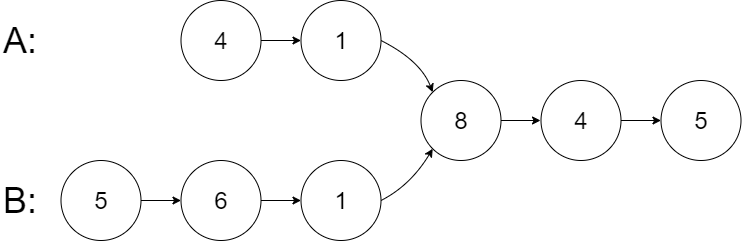

## Problem
Given the heads of two singly linked-lists headA and headB, return the node at which the two lists intersect.
If the two linked lists have no intersection at all, return null.

## Sample

Input: intersectVal = 8, listA = [4,1,8,4,5], listB = [5,6,1,8,4,5], skipA = 2, skipB = 3
Output: Intersected at '8'

## Approaches
### Approach 1 - Length Alignment Technique / Two Pointer Synchronization
- Traverse List A → calculate `sizeA`.
- Traverse List B → calculate `sizeB`.
- Reset pointers:
    - `tempA = headA`
    - `tempB = headB`
- Find length difference:
    - `diff = |sizeA - sizeB|`
- Move pointer of longer list ahead by `diff` steps.
    - This aligns both lists at equal remaining length.
- Traverse both lists together:
    - If `tempA == tempB` → intersection found.
    - Move both one step at a time.
- If traversal ends → return null (no intersection).
- Time Complexity: O(n + m), Space Complexity: O(1)

### Approach2 – Hashing (Store Visited Nodes) (Brute Force)
- Initialize a HashSet to store visited nodes.
- Traverse List A:
    - Add each node reference to the HashSet.
- Traverse List B:
    - For each node, check if it exists in the HashSet.
    - If yes → intersection found.
- If traversal completes → return null.
- Time Complexity: O(n + m), Space Complexity: O(n)

## Codes
### Length Alignment Technique / Two Pointer Synchronization
```java
public ListNode getIntersectionNode(ListNode headA, ListNode headB) {

    // Step 1: Calculate lengths of both lists
    int sizeA = 0, sizeB = 0;
    ListNode tempA = headA, tempB = headB;

    while (tempA != null) {
        sizeA++;
        tempA = tempA.next;
    }

    while (tempB != null) {
        sizeB++;
        tempB = tempB.next;
    }

    // Step 2: Align both lists
    tempA = headA;
    tempB = headB;
    int diff = Math.abs(sizeA - sizeB);

    if (sizeA > sizeB) {
        while (diff-- > 0) {
            tempA = tempA.next;
        }
    } else {
        while (diff-- > 0) {
            tempB = tempB.next;
        }
    }

    // Step 3: Traverse together to find intersection
    while (tempA != null && tempB != null) {
        if (tempA == tempB) {
            return tempA;   // Intersection found
        }
        tempA = tempA.next;
        tempB = tempB.next;
    }

    return null;  // No intersection
}
```
### Hashing (Store Visited Nodes) (Brute Force)
```java
public ListNode getIntersectionNode(ListNode headA, ListNode headB) {

    Set<ListNode> visited = new HashSet<>();

    // Store all nodes of List A
    ListNode current = headA;
    while (current != null) {
        visited.add(current);
        current = current.next;
    }

    // Check nodes of List B
    current = headB;
    while (current != null) {
        if (visited.contains(current)) {
            return current;  // Intersection found
        }
        current = current.next;
    }

    return null;  // No intersection
}
```

## New Learnings
- Length Alignment Technique